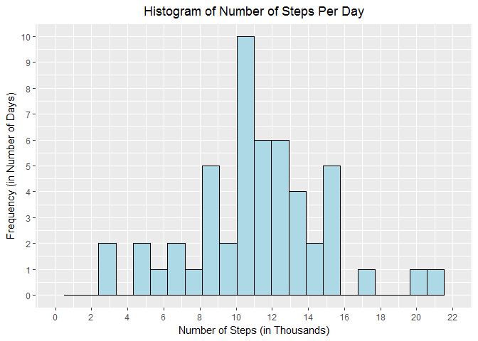
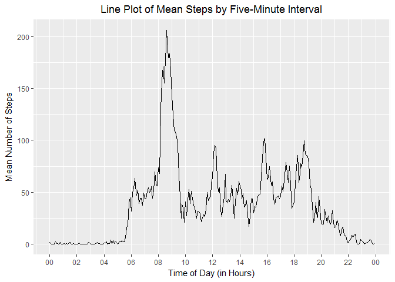
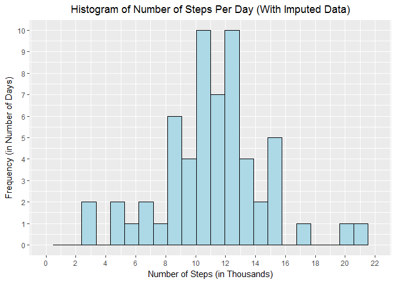
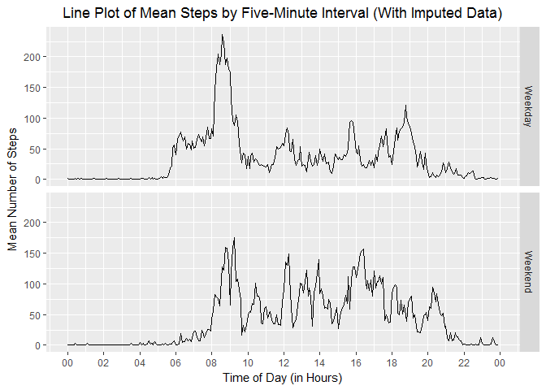

# Reproducible Research: Peer Assessment 1
Ian Feller  
March 25, 2017  
## Assignment Description
##### This assignment makes use of data from a personal activity monitoring device. This device collects data at 5 minute intervals through out the day. The data consists of two months of data from an anonymous individual collected during the months of October and November, 2012 and include the number of steps taken in 5 minute intervals each day.  

## Load Libraries, Set Options (Force Non Exponential Notation), and Unzip Data as Needed

```r
library(knitr)
library(dplyr)
library(lubridate)
library(scales)
library(ggplot2)
library(ggthemes)

options(scipen=10)
opts_chunk$set(echo=TRUE)


if(!file.exists('activity.csv')){
    unzip('activity.zip')
}
```

## Loading and preprocessing the data

####Show any code that is needed to:
 1. Load the data (i.e. read.csv()).
 2. Process/transform the data (if necessary) into a format suitable for your analysis.


### Read in data and Review Structure and Contents

```r
activity_data <- read.csv(file = "activity.csv",header = T)

str(activity_data)
```

```
## 'data.frame':	17568 obs. of  3 variables:
##  $ steps   : int  NA NA NA NA NA NA NA NA NA NA ...
##  $ date    : Factor w/ 61 levels "2012-10-01","2012-10-02",..: 1 1 1 1 1 1 1 1 1 1 ...
##  $ interval: int  0 5 10 15 20 25 30 35 40 45 ...
```

```r
summary(activity_data)
```

```
##      steps                date          interval     
##  Min.   :  0.00   2012-10-01:  288   Min.   :   0.0  
##  1st Qu.:  0.00   2012-10-02:  288   1st Qu.: 588.8  
##  Median :  0.00   2012-10-03:  288   Median :1177.5  
##  Mean   : 37.38   2012-10-04:  288   Mean   :1177.5  
##  3rd Qu.: 12.00   2012-10-05:  288   3rd Qu.:1766.2  
##  Max.   :806.00   2012-10-06:  288   Max.   :2355.0  
##  NA's   :2304     (Other)   :15840
```

```r
num_obs <- nrow(activity_data)
```
##### The data has 17568 observations, compared with the 17,568 observations identified in the instructions.

### Convert date variables to date data type

```r
activity_data_clean <- activity_data %>%
  mutate(date= as.Date(date,"%Y-%m-%d"))
```


## What is mean total number of steps taken per day?

#### For this part of the assignment, you can ignore the missing values in the dataset.
1. Calculate the total number of steps taken per day

```r
steps_per_day <- activity_data_clean %>%
  group_by(date) %>%
  summarize(steps_day=sum(steps)) %>%
  ungroup()
```

2. Make a histogram of the total number of steps taken each day


```r
steps_hist <- ggplot(steps_per_day, aes(steps_day/1000))

steps_hist + geom_histogram(bins = 24,colour = "black",fill="light blue") +
  labs(title= "Histogram of Number of Steps Per Day",
       x="Number of Steps (in Thousands)",
       y="Frequency (in Number of Days)") +
  scale_x_continuous(limits=c(0,22),breaks=seq(0,22,2)) +
  scale_y_continuous(limits=c(0,10),breaks=seq(0,10,1)) +
  theme(plot.title = element_text(hjust = 0.5))
```

```
## Warning: Removed 8 rows containing non-finite values (stat_bin).
```

<!-- -->


3. Calculate and report the mean and median of the total number of steps taken per day


```r
summary(steps_per_day$steps_day)
```

```
##    Min. 1st Qu.  Median    Mean 3rd Qu.    Max.    NA's 
##      41    8841   10760   10770   13290   21190       8
```

```r
mean_steps_day <- mean(steps_per_day$steps_day,na.rm = T)
median_steps_day <- median(steps_per_day$steps_day,na.rm = T)
```
##### The mean and median number of steps per day are 10766.1886792 and 10765 respectively.


## What is the average daily activity pattern?

#### Make a time series plot (i.e. type = "l") of the 5-minute interval (x-axis) and the average number of steps taken, averaged across all days (y-axis)


### Calculate Steps per Interval (i.e. Time of Day)


```r
steps_per_interval <- activity_data_clean %>%
  group_by(interval) %>%
  summarize(mean_steps_interval=mean(steps,na.rm=T)) %>%
  ungroup() %>%
  mutate(time=as.character(interval)) %>%
  mutate(time=ifelse(nchar(time)==1, paste0("000",time),
                     ifelse(nchar(time)==2, paste0("00",time),
                            ifelse(nchar(time)==3, paste0("0",time),time)))) %>%
  mutate(time = as.POSIXct(time, "%H%M",tz="America/New_York")) %>%
  select(-interval)
```

### Generate Time Series Plot

```r
steps_line <- ggplot(steps_per_interval, aes(time,mean_steps_interval))

steps_line + geom_line() +
  labs(title= "Line Plot of Mean Steps by Five-Minute Interval",
       x="Time of Day (in Hours)",
       y="Mean Number of Steps") +
  scale_x_datetime(breaks= date_breaks("2 hours"), date_labels = "%H") +
  theme(plot.title = element_text(hjust = 0.5))
```

<!-- -->

#### Which 5-minute interval, on average across all the days in the dataset, contains the maximum number of steps?

```r
max_avg_num_steps <- steps_per_interval %>%
  filter(mean_steps_interval==max(mean_steps_interval)) %>%
  select(time) %>%
  format("%H:%M")
```

##### On average, the five minute interval beginning at 08:35 (military time) contains the most steps.


## Imputing missing values

#### Note that there are a number of days/intervals where there are missing values (coded as NA). The presence of missing days may introduce bias into some calculations or summaries of the data.

1. Calculate and report the total number of missing values in the dataset (i.e. the total number of rows with NAs)


```r
missing_steps <- sum(is.na(activity_data$steps))
```
##### The total number of missing steps is  2304.


2. Devise a strategy for filling in all of the missing values in the dataset. The strategy does not need to be sophisticated. For example, you could use the mean/median for that day, or the mean for that 5-minute interval, etc.

##### The imputation technique, shown below, replaces missing step values with the average number of steps for the giving five minute interval that day of the week. The primary motivation for this methodology is that individuals generally experience a pattern of behavior in their lives. For those tracking their fitness, a routine and homogenenous exercise habit is likely. This is supported by the following data investigation.


###Total Number of Missing Steps by Interval

```r
activity_data %>%
  filter(is.na(steps)==T) %>%
  group_by(interval) %>%
  summarize(missing_count=n()) %>%
  ungroup() %>%
  summary()
```

```
##     interval      missing_count
##  Min.   :   0.0   Min.   :8    
##  1st Qu.: 588.8   1st Qu.:8    
##  Median :1177.5   Median :8    
##  Mean   :1177.5   Mean   :8    
##  3rd Qu.:1766.2   3rd Qu.:8    
##  Max.   :2355.0   Max.   :8
```
##### The number of missing steps for a given interval is always 8, indicating no bias among intervals. 


###Total Number of Missing Steps by Day of Week

```r
activity_data_clean %>%
  filter(is.na(steps)==T) %>%
  mutate(day_of_week = weekdays(date)) %>%
  group_by(day_of_week) %>%
  summarize(missing_count=n()) %>%
  ungroup()
```

```
## # A tibble: 6 × 2
##   day_of_week missing_count
##         <chr>         <int>
## 1      Friday           576
## 2      Monday           576
## 3    Saturday           288
## 4      Sunday           288
## 5    Thursday           288
## 6   Wednesday           288
```

######Monday and Friday have an additional day of missing values (there are 288 5-minute intervals in a day), but given two months of data (approximately 8-9 total days for each day of the week), this is not a significant bias.

3. Create a new dataset that is equal to the original dataset but with the missing data filled in.


```r
activity_data_impute <- activity_data_clean %>%
  mutate(day_of_week = weekdays(date)) %>%
  group_by(day_of_week,interval) %>%
  mutate(impute_val=mean(steps,na.rm=T)) %>%
  ungroup() %>%
  mutate(steps_imputed = ifelse(is.na(steps)==T,impute_val,steps)) %>%
  mutate(steps_imputed = as.numeric(steps_imputed))
```

4. Make a histogram of the total number of steps taken each day and calculate and report the mean and median total number of steps taken per day.

### Calculate the Number of Steps per Day with Imputed Data

```r
impsteps_per_day <- activity_data_impute %>%
  group_by(date) %>%
  summarize(steps_day=sum(steps_imputed)) %>%
  ungroup()
```

### Generate Histogram of Number of Steps per Day Using Imputed Data

```r
impsteps_hist <- ggplot(impsteps_per_day, aes(steps_day/1000))

impsteps_hist + geom_histogram(bins = 24,colour = "black",fill="light blue") +
  labs(title= "Histogram of Number of Steps Per Day (With Imputed Data)",
       x="Number of Steps (in Thousands)",
       y="Frequency (in Number of Days)") +
  scale_x_continuous(limits=c(0,22),breaks=seq(0,22,2)) +
  scale_y_continuous(limits=c(0,10),breaks=seq(0,10,1)) +
  theme(plot.title = element_text(hjust = 0.5))
```

<!-- -->

###    Do these values differ from the estimates from the first part of the assignment? What is the impact of imputing missing data on the estimates of the total daily number of steps?


### Recalculate mean and median of total steps per day using imputed data.

```r
summary(impsteps_per_day$steps_day)
```

```
##    Min. 1st Qu.  Median    Mean 3rd Qu.    Max. 
##      41    8918   11020   10820   12810   21190
```

```r
imp_mean_steps_day <- mean(impsteps_per_day$steps_day,na.rm = T)
imp_median_steps_day <- median(impsteps_per_day$steps_day,na.rm = T)
```
##### The mean and median number of steps per day using the imputed data are 10821.2096019 and 11015 respectively.  

##### Compared with the original mean and median of 10766 and 10765, respectively, the data imputation did not have a major impact on average the number of steps per day. As briefly discussed above, the imputation technique assumes the data comes from a user that has a general pattern for their lifestyle for each five minute interval each day of the week. If this hypothesis was correct, taking the mean number of steps for each five minute interval across each weekday, as was used for this imputation, would produce a day of steps very similar to any other day. The missing number of steps by time of day (i.e interval) was uniform, which was the most likely factor to bias the results. 

##### For example, missing time from a particularly active or inactive hour could alter the results after imputation. While there was one additional missing day of data for Monday or Friday, it was not substantial, and did not appear to have a major impact on the results after imputation.


## Are there differences in activity patterns between weekdays and weekends?

### Create a new factor variable in the dataset with two levels - "weekday" and "weekend" indicating whether a given date is a weekday or weekend day.

```r
weekday_data <- activity_data_impute  %>%
  mutate(weekday = ifelse(day_of_week %in% c("Saturday", "Sunday"), "Weekend","Weekday"))
```

### Make a panel plot containing a time series plot (i.e. type = "l") of the 5-minute interval (x-axis) and the average number of steps taken, averaged across all weekday days or weekend days (y-axis).

### Calculate Steps per Interval (i.e. Time of Day) Using Imputed Data

```r
impsteps_per_interval <- weekday_data %>%
  group_by(weekday,interval) %>%
  summarize(mean_steps_interval=mean(steps_imputed,na.rm=T)) %>%
  ungroup() %>%
  mutate(time=as.character(interval)) %>%
  mutate(time=ifelse(nchar(time)==1, paste0("000",time),
                     ifelse(nchar(time)==2, paste0("00",time),
                            ifelse(nchar(time)==3, paste0("0",time),time)))) %>%
  mutate(time = as.POSIXct(time, "%H%M",tz="America/New_York")) %>%
  select(-interval)
```

### Generate Time Series Plot Using Imputed Data

```r
impsteps_line <- steps_hist <- ggplot(impsteps_per_interval, aes(time,mean_steps_interval)) 

impsteps_line + geom_line() +
  labs(title= "Line Plot of Mean Steps by Five-Minute Interval (With Imputed Data)",
       x="Time of Day (in Hours)",
       y="Mean Number of Steps") +
  facet_grid(weekday~.) +
  scale_x_datetime(breaks= date_breaks("2 hours"), date_labels = "%H") +
  theme(plot.title = element_text(hjust = 0.5))
```

<!-- -->

##### Based on the graphs above, it appears that there are two very different patterns of activity between weekdays and weekends. On the weekdays, there is more activity between 6am and 8am, with a much higher maximum between 8am and 9am. During the weekends, however, there is more activity during the mid-morning and early afternoon (10am - 5pm).
